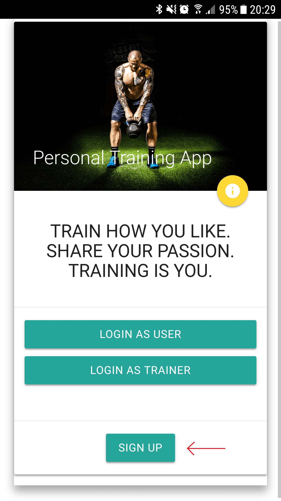
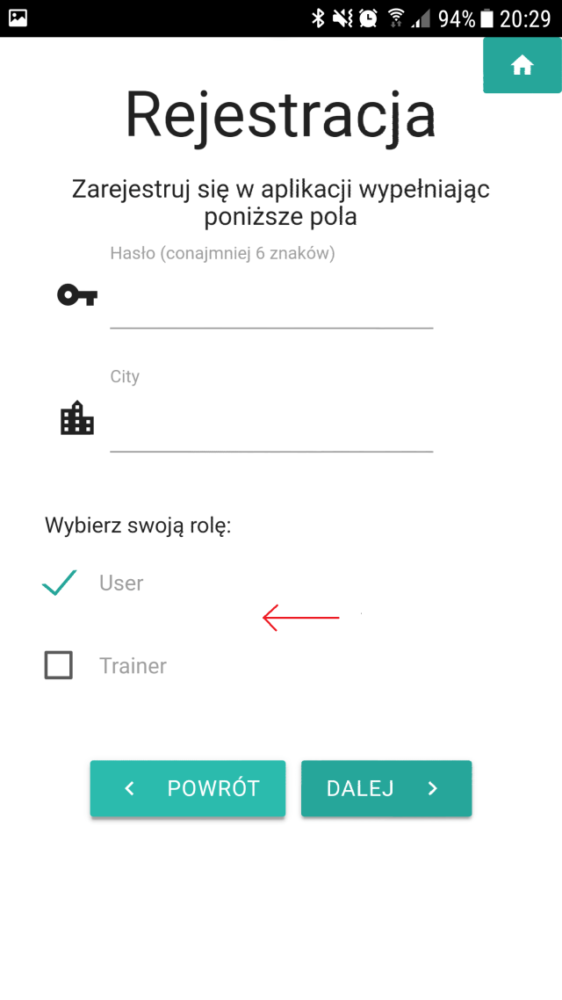
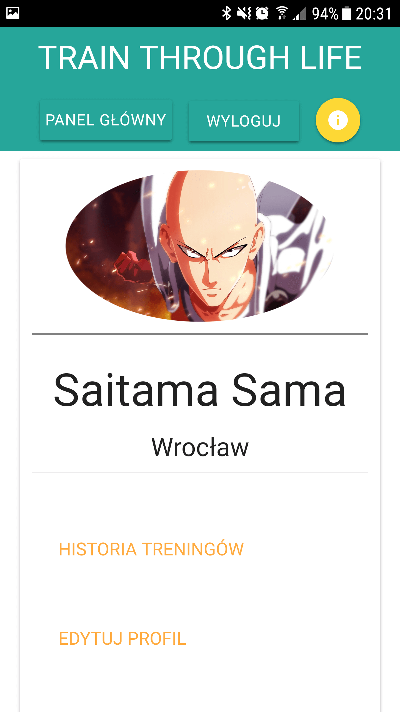
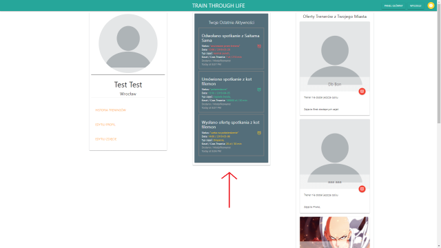
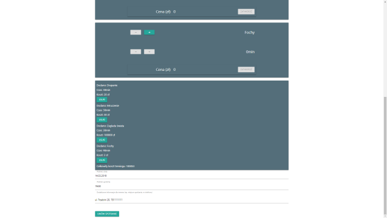

# Train Through Life
## TTL

### Contact with your personal trainer, find new trainers in your city, schedule some trainings. Train through life.
If you want to look at current project's stage, click this link: https://lexaeterna12321.github.io/Train-Through-Life/

## Table of contents
* General info
* Technologies
* How To Start

## General info

This project is made to create easy and comfortable contact between trainer and user. You can easily sign up and schedule your first training with one of personal trainers in your city. As a trainer, you can add trainings you wish to train your clients, as well as preffered cost of your training.
	
 
## Technologies

Project is created with:
* React version: 16.7.0
* Redux version: 4.0.1
* Firebase version: 5.7.3
* Materialize CSS version: 1.0.0
* can be used as Progressive Web App

## HowToStart

---

1. To start using Traing through life simply click sign up in a home screen ->

---

2. Remember that you can sign up either as user or trainer with unique options in each group

---

3. Next step is to login as freshly baked user or trainer

---

4. In your dashboard you can add your avatar photo, manage your profile and browse your training history. As logged user you can look for personal trainers in your city. As a trainer you can respond to users activities.

---

5. Add trainings, reserve some quality time with your personal trainer.

